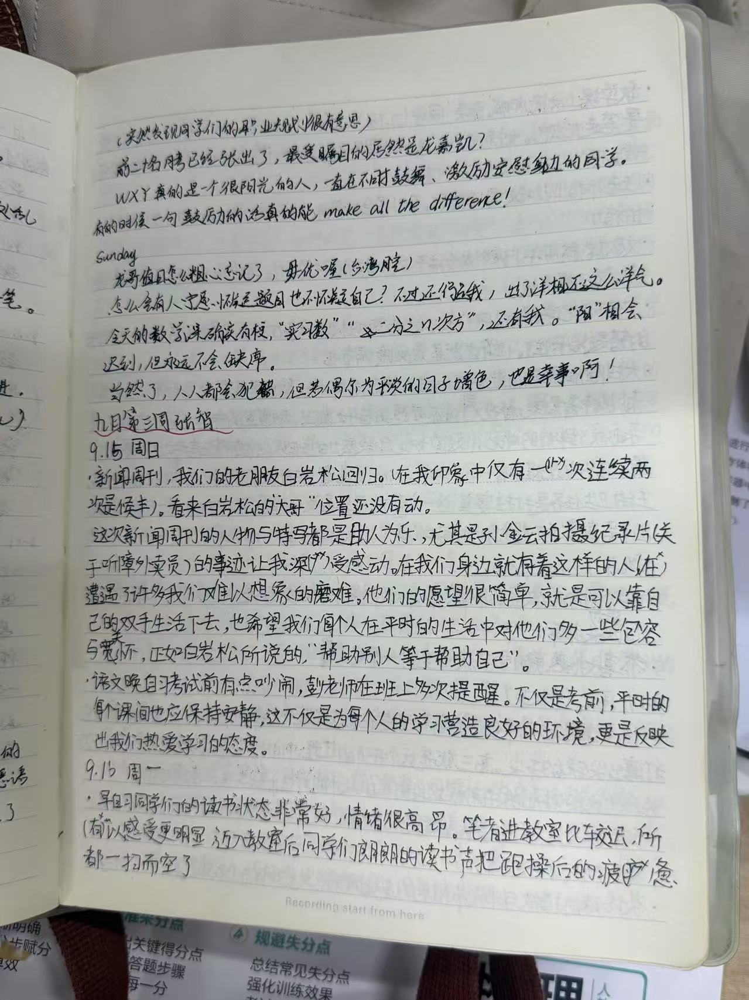

# 九月第二周 by 李阳

开发者注：由于作者本人过于害羞，文字版不完整，于是在末尾附上高清原图

## 9月8日 周日
- 看到雅彬笔录，阳阳结舌瞠目。足足写了五页半，阳阳满头大汗。吾本七尺汉，心头亦犯难，不管不管，先看新闻周刊。
- 今天主持是侯丰，竟然不是白岩松。也行也行，王妈说要欢迎新面孔。
大家一定少喝饮料！老家传来噩耗，发小三高病倒。都怪乱喝饮料，对肾真的不好。
- 需要与被需要，是可治愈一切的良药
- 今夜月色真好，依旧语文周考。天山月似钩，考完累成狗

## 9月9日 周一
- 9月9日星期一，国旗讲话罗泽羿。言谈尽书生意气，迷倒万千迷妹迷弟。拼搏乃演讲主题，旁征博引举事例，论证分析入肌理。结尾呼吁强有力，这就是太子实力？小生服矣！
- 周一数学课前，朱君沉沉酣眠。
- 物理课上仍有甲课乙事。

## 9月10日 周二
- 数学课前的问候毫无默契啊～
- 果然不完美才是最完美～且行且珍惜
- 语文课的问候进步了。
- 徐sir在英语课上有点甜～

## 9月11日 周三 雨转晴
- Stay hungry, stay foolish.
- 语文课电脑不给力啊～宿管得精进一下技艺啊
- 欢迎玖芊媛同学加盟՞˶･֊･˶՞ 
- 体育课后凑凑的

## 9月12日 疯狂星期四（shi四声）
- 郑媛老师来班，同学们很给力
- 跑操惊现“徐浩然”？！
- 语文作文没写完，今天就是deadline。垂死病中惊坐起，作文未曾动一笔。
- 鑫科超暖der

## 9月13日 周五
- 斯斯说门上有包子油。。。好𫫇哦
- “尘埃落定前，请倾尽全力。”

## 9月14日 周六
- 目标出炉，一起进步！
- 无形的理想支撑起了有形的现实
- 但行好事，莫问前程
- “时人不识凌云木，直待凌云始道高。”
- WXY真的是个很阳光的人啊，永远给周围的人带来鼓舞！
- 龙哥怎么忘了值日？毋优哦，不乘哦～
- 是谁怀疑题目也不怀疑自己？小生我不行了
- 当然了，人人都会犯错，但生活也许因此增色呢

## 总结:
“看似寻常最奇崛，成如容易却艰辛。”有幸执笔，捕获生活幸福的琐细，幸甚。

## 原图：

